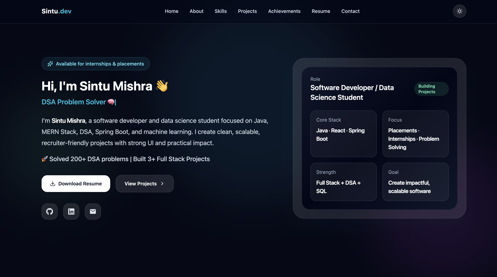

# 🚀 Sintu Mishra - Developer Portfolio

🔗 Live: https://portfolio-flame-six-93wdoxmah1.vercel.app/

---

## 👨‍💻 About

This is my personal developer portfolio built to showcase my skills, projects, and achievements as a Software Developer and Data Science student.

---

## ⚡ Tech Stack

- React.js
- Tailwind CSS
- Framer Motion
- JavaScript

---

## ✨ Features

- Modern UI/UX design
- Fully responsive (mobile + desktop)
- Dark/Light mode
- Smooth animations
- Project showcase with live links
- Resume download

---

## 📌 Featured Projects

### 🚌 Bus Route Optimizer
Smart system for optimizing bus routes using traffic logic.

### 🛠 Campus Issue Tracker
Full-stack system with authentication and role-based access.

### 🧮 JavaFX Scientific Calculator
Desktop app built using JavaFX.

---

## 📸 Screenshots

---

## 📬 Contact

- GitHub: https://github.com/SintuMishra
- LinkedIn: https://www.linkedin.com/in/sintu-mishra-3o11/

---

## ⭐ If you like this project, give it a star!