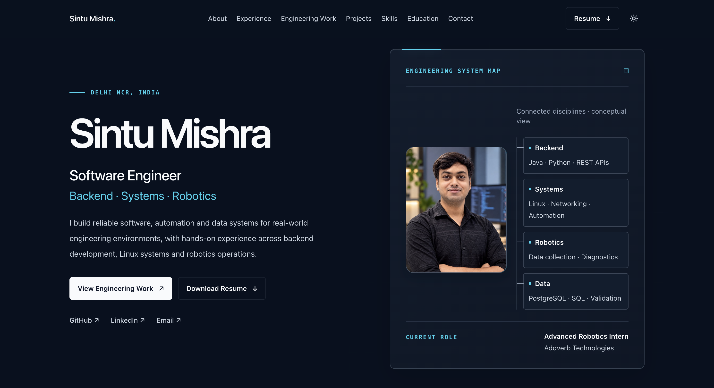

# Sintu Mishra — Engineering Portfolio

Personal engineering portfolio for **Sintu Mishra**, focused on backend software, Linux systems, automation, robotics-oriented engineering, data workflows, and production-style full-stack applications.

**Live Portfolio:**
https://portfolio-flame-six-93wdoxmah1.vercel.app/

---

## Engineering Profile

**Software Engineer · Backend · Systems · Robotics**

The portfolio presents experience and projects across:

- Backend engineering and REST APIs
- Linux systems and automation
- Robotics data workflows and diagnostics
- Relational databases and structured data
- Full-stack application development
- System integration and operational tooling

Professional robotics work is intentionally described at a high level. Proprietary source code, internal infrastructure details, private datasets, credentials, and confidential systems are not published.

---

## Technology Stack

### Frontend

- React 19
- Vite
- JavaScript
- Tailwind CSS
- Framer Motion
- Lucide React
- React Icons

### Engineering & Tooling

- ESLint
- PostCSS
- Autoprefixer
- Git / GitHub
- Vercel

The interface includes responsive layouts, light/dark themes, keyboard-accessible navigation, reduced-motion support, and reusable UI components.

---

## Portfolio Structure

    src/
    ├── components/
    │   ├── layout/
    │   ├── sections/
    │   └── ui/
    ├── data/
    │   └── portfolio.js
    ├── hooks/
    │   └── useTheme.js
    ├── assets/
    ├── App.jsx
    ├── main.jsx
    └── index.css

    public/
    ├── og-portfolio.png
    └── other static assets

### Key Areas

- `src/App.jsx` — application composition and theme integration
- `src/components/layout/` — navigation and footer
- `src/components/sections/` — About, Experience, Engineering Work, Projects, Skills, Education, and Contact
- `src/components/ui/` — reusable interface components
- `src/data/portfolio.js` — professional content and selected project data
- `src/hooks/useTheme.js` — theme persistence and system-preference handling
- `src/index.css` — design system, responsive behavior, accessibility, and shared styling

---

## Selected Projects

### InfraFlow ERP

Construction operations and accounting platform with company-scoped workflows, procurement, finance, authentication, PostgreSQL, and containerized development.

**Stack:** React, Vite, Node.js, Express, PostgreSQL, JWT, Docker

**Source:** https://github.com/SintuMishra/infraflow-erp
**Live:** https://infraflow-erp-ten.vercel.app

---

### SinFleet ERP

Multi-tenant fleet-management ERP SaaS for vehicles, drivers, trips, fuel, expenses, payments, and operational reporting.

**Stack:** TypeScript, Next.js, React, Express, PostgreSQL, Prisma, JWT

**Source:** https://github.com/SintuMishra/sinfleet-erp-saas

---

### Team Task Manager

Full-stack team collaboration platform with JWT authentication, role-based access control, project membership, and structured task workflows.

**Stack:** React, Vite, Express, PostgreSQL, Prisma, JWT, Zod

**Source:** https://github.com/SintuMishra/team-task-manager-fullstack
**Live:** https://team-task-manager-fullstack-bcji.onrender.com

---

### Survey Campaign Builder

Configurable React + TypeScript survey builder with conditional flows, real-time styling controls, media support, and live mobile preview.

**Stack:** React, TypeScript, Vite, Context API, useReducer, Lottie

**Source:** https://github.com/SintuMishra/survey-campaign-builder
**Live:** https://survey-campaign-builder-eight.vercel.app

---

### Campus Issue Tracker

Role-based campus issue tracking system with a Java/Spring Boot backend, PostgreSQL persistence, authentication, administrative workflows, and a separate React frontend.

**Stack:** Java, Spring Boot, Spring Security, PostgreSQL, React, Vite

**Frontend:** https://github.com/SintuMishra/issue-tracker-frontend
**Backend:** https://github.com/SintuMishra/issue-tracker-backend
**Live:** https://issue-tracker-frontend-two.vercel.app

---

## Local Development

### Requirements

Use Node.js **22.12+** or a compatible newer LTS release.

### Setup

    git clone https://github.com/SintuMishra/portfolio.git
    cd portfolio
    npm ci
    npm run dev

### Quality Checks

    npm run lint
    npm run build
    npm audit

### Production Preview

    npm run preview

Vite generates the production build in `dist/`.

---

## Social Preview & Metadata

The portfolio includes explicit Open Graph and Twitter/X metadata for professional sharing on platforms such as LinkedIn.

The social preview is stored at:

    public/og-portfolio.png

Sharing metadata includes:

- Portfolio title
- Engineering-focused description
- Production portfolio URL
- Open Graph preview image
- Large Twitter/X preview card
- Accessible image alternative text

---

## Content & Privacy

Professional engineering experience is separated from personal open-source projects.

Employer-related work is documented only at a safe, high level. This repository does **not** publish:

- Proprietary employer source code
- Internal network details
- Private datasets
- Credentials or secrets
- Confidential infrastructure
- Internal operational identifiers

Personal project information links only to repositories and deployments intended for public presentation.

---

## Accessibility & UX

The portfolio includes:

- Responsive layouts
- Keyboard-accessible navigation
- Visible focus states
- Reduced-motion support
- Light and dark themes
- Semantic section structure
- Responsive engineering diagrams
- Mobile navigation
- Direct resume and contact actions

---

## Contact

**Sintu Mishra**
Software Engineer — Backend, Systems & Robotics

**Portfolio:** https://portfolio-flame-six-93wdoxmah1.vercel.app/
**GitHub:** https://github.com/SintuMishra
**LinkedIn:** https://www.linkedin.com/in/sintu-mishra-3o11/
**Email:** sintumishra22201@gmail.com

---

Built with React, Vite, Tailwind CSS, and an engineering-focused design system.
